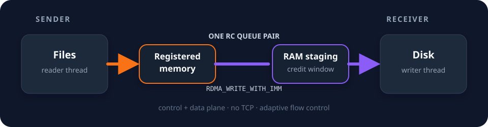

<div align="center">
  
  <h1>ibsend</h1>
  <p><strong>InfiniBand 向けの高速ファイル転送ツール。</strong></p>
  <p>
    <a href="https://github.com/HiroGitea/ibsend/actions/workflows/build.yml"></a>
    
    
    <a href="#ライセンス"></a>
  </p>
  <p><a href="../README.md">English</a> · <a href="README.zh-CN.md">简体中文</a> · <strong>日本語</strong></p>
</div>

ibsend は、InfiniBand または RoCE ネットワーク上の Linux ホスト間でファイルを
転送するツールです。RDMA でファイルやディレクトリを直接転送でき、ピアの検出、
中断した転送の再開、オプションのデスクトップ GUI に対応しています。

受信側はデータをメモリに一時保存しながらディスクに書き込みます。ストレージへの
書き込みが一時的に遅くなっても、空きバッファを使って受信を続けられます。
記録済みの QDR テストでは **3.47 GB/s** に達しました。環境と測定範囲は
[パフォーマンス](#パフォーマンス)を参照してください。

ibsend は**信頼できるプライベート RDMA ネットワーク**向けです。暗号化やピア認証は
提供していません。CLI と GUI のメッセージは現在中国語のみで、ドキュメントは
英語・簡体字中国語・日本語で提供しています。

[インストール](#インストール) · [クイックスタート](#クイックスタート) ·
[コマンド](#コマンド) · [パフォーマンス](#パフォーマンス) · [制限事項](#制限事項)

## 主な機能

- **RDMA による直接転送**：ファイルデータと制御メッセージが同じ RDMA 接続を使い、
  別途 TCP チャネルを設ける必要がありません。
- **メモリバッファの自動調整**：利用可能なメモリとメモリロック上限に応じてプールを
  調整し、ディスクへの書き込みを非同期に行います。
- **転送の再開と検証**：中断時に残った `.part` ファイルから転送を再開し、
  転送したバイト列を CRC32C で検証します。
- **ファイル・ディレクトリ・ピア検出**：複数のパスを一度に送信し、IPoIB サブネット上で
  受信側を検出できます。GUI でのドラッグ＆ドロップにも対応しています。

## インストール

両方のマシンに Linux、RDMA 対応アダプター、設定済みの RDMA 接続が必要です。
InfiniBand では、ibsend を起動する前に IPoIB アドレスを設定してください。
ソースからのビルドには、新しい安定版 Rust ツールチェーン、C コンパイラ、
`rdma-core` の `libibverbs` と `librdmacm` の開発用ヘッダーが必要です。

Debian / Ubuntu では、次のコマンドでビルド依存パッケージをインストールできます。

```sh
sudo apt-get install build-essential libibverbs-dev librdmacm-dev
```

両方のマシンで CLI をビルドしてインストールします。

```sh
git clone https://github.com/HiroGitea/ibsend.git
cd ibsend
cargo install --path . --locked
```

`$HOME/.cargo/bin` が `PATH` に含まれていることを確認してください。

GUI を使う場合は、デスクトップ用の依存パッケージを追加し、`gui` 機能を有効にします。
Debian / Ubuntu でのコマンドは次のとおりです。

```sh
sudo apt-get install libwayland-dev libxkbcommon-dev
cargo install --path . --locked --features gui
```

これにより `ibsend` と `ibsend-gui` の両方がインストールされます。
既定の CLI ビルドには GUI の依存パッケージは不要です。

### メモリロック

RDMA では、登録したメモリを RAM に常駐させる必要があります。メモリロック上限により
バッファプールが制限されていると表示された場合は、次を実行してください。

```sh
ibsend authorize
```

このコマンドは polkit または `sudo` を通じて、インストール済みバイナリに
`CAP_IPC_LOCK` 権限を設定します。対話的な認可ができない環境では、手動設定用の
コマンドを表示します。既存の上限で十分な場合は変更しません。認可後は実行中の
ibsend を再起動してください。GUI から認可した場合は自動で再起動します。

権限は、そのバイナリを実行するすべてのユーザーに適用されます。再ビルドや再インストールで
失われることがあるため、更新後は再度の認可が必要になる場合があります。

## クイックスタート

**受信側のマシン**で、`nas` という名前の受信サービスを起動します。

```sh
ibsend daemon --name nas --out ./received
```

このプロセスを実行したままにします。受信ファイルは、起動したディレクトリを基準とする
`./received` に保存されます。

**送信側のマシン**で受信側を検出し、ファイルまたはディレクトリを送信します。

```sh
ibsend discover
ibsend send nas ./big.iso
ibsend send nas ./photos
```

受信側に `received/big.iso` と `received/photos/` が作成され、ディレクトリ内の
相対パスが維持されます。`ibsend send nas ./big.iso ./photos` と指定すれば、
複数のパスをまとめて送信できます。

アドレスで接続する場合は、`nas` を受信側の RDMA IPv4 アドレスに置き換えます。

```sh
ibsend send 10.0.0.1 ./big.iso
```

インターフェースの自動選択とピア検出は IPoIB を使用します。RoCE では受信側で
`--bind <RDMA-IPv4-address>` を明示し、送信側からそのアドレスを直接指定してください。
上の例の `nas` は ibsend のピア検出で使う名前です。

デスクトップでは `ibsend-gui` を起動し、送信先を選んでファイルをウィンドウに
ドラッグ＆ドロップします。**Ctrl+S** で送信できます。

## コマンド

| コマンド | 説明 |
|---|---|
| `ibsend daemon` | 受信サービスを常駐させ、ピア検出に応答します。 |
| `ibsend discover` | ローカル IPoIB サブネット上の受信側を一覧表示します。 |
| `ibsend send <peer> <paths…>` | ピア名または IPv4 アドレスを指定してファイルやディレクトリを送信します。 |
| `ibsend recv` | 1 回の転送を受信して終了します。 |
| `ibsend authorize` | 必要に応じてメモリロック権限を設定します。 |
| `ibsend-gui [files…]` | オプションのデスクトップ GUI を開きます。 |

`daemon` と `recv` のオプション：

| オプション | 既定値 | 説明 |
|---|---|---|
| `--bind <IP>` | 最初の IPoIB アドレス | 待ち受けに使用するローカル RDMA アドレス。 |
| `--out <DIR>` | カレントディレクトリ | 受信ファイルの保存先。 |
| `--name <NAME>` | ホスト名 | ピア検出時に公開する名前。 |
| `--pool <SIZE>` | 自動 | 受信側のメモリバッファプールのサイズ。 |
| `--slab <SIZE>` | 自動 | 転送ブロックのサイズ。 |

サイズには `K`、`M`、`G` の接尾辞を使用でき、1024 の累乗で解釈されます。
例えば `--pool 2G` は 2 GiB のプールを要求します。送信側の `--slabs <N>` は
パイプラインの深さを指定し、既定値は 16 です。`discover --timeout <MS>` は
アドレスごとの解決タイムアウトを指定し、既定値は 300 ミリ秒です。
引数なしで `ibsend` を実行すると使い方を表示します。

## 再開と検証

転送が中断した場合は、同じソースファイルと保存先を使って送信コマンドを再実行します。
受信側は保存先のパスごとに次の処理を行います。

| 保存先の状態 | 動作 |
|---|---|
| 想定サイズの完成済みファイルがある | ファイルをスキップします。 |
| 未完了の `.part` ファイルがある | 現在のバイト位置から再開します。 |
| どちらもない | 最初から転送します。 |

再開するために `.part` ファイルは残してください。完成済みファイルをスキップするかどうかは
**サイズのみ**で判断し、内容は比較しません。

CRC32C は、送信側が読み取ったバイト列と受信側の書き込みスレッドが処理したバイト列を
比較します。再開したファイルでは今回送信した部分だけを検証し、既存の部分は再検証しません。
保存先ファイルをディスクから読み戻す検証も行いません。チェックサムの結果は受信側の
出力で確認してください。

## パフォーマンス

以下は、デュアルポート 40 Gb QDR アダプターと PCIe 2.0 x8 接続を備えた 2 台の
ホストで記録した結果です。IPoIB は connected モード、MTU は 65520 を使用しました。
送信側はローリングリリースの Linux、受信側は Debian 12 です。
数値はこの環境での測定結果であり、実際の速度はハードウェアや負荷によって変わります。

転送量が受信側のバッファプールより小さい場合：

| 送信側パイプライン | 転送速度 |
|---|---|
| 6 × 1 MB ブロック | **3.47 GB/s** |
| 3 × 2 MB ブロック | **3.47 GB/s** |
| 1 × 4 MB ブロック | 1.94 GB/s |

別のテストでは、1.5 GB のバッファプールで約 2 GB のデータを ZFS ストレージに転送しました。

| 測定対象 | 経過時間 | 速度 |
|---|---|---|
| 送信側のデータ転送 | **0.62 s** | **3.48 GB/s** |
| 受信側（ファイル書き込みを含む） | 2.58 s | 831 MB/s |

**送信側の計測時間と受信側の完了時間は、異なる処理範囲を表します。** メモリバッファにより、
受信側が書き込みを続けている間に送信側はデータ転送を終えられます。プールが埋まると
送信側は空きを待つため、持続的なスループットは受信側の書き込み速度に制限されます。
ソースの読み取り速度、アダプターと PCIe の帯域幅、利用可能なメモリも性能に影響します。

## 仕組み

ibsend は 1 本の信頼性のある RDMA 接続でファイル一覧、制御メッセージ、ファイルデータを
やり取りします。アダプターが受信データを登録済みメモリプールに直接書き込み、
専用の書き込みスレッドがファイルに保存してバッファを解放します。
受信サービスはセッションをまたいで同じメモリプールを再利用します。

<p align="center">
  
</p>

プロトコル、バッファ管理、スレッド構成、Rust ライブラリの使用例は
[設計ドキュメント（英語）](design.md)を参照してください。

## 制限事項

- **信頼できるネットワーク専用**：暗号化と認証は提供しません。
  RDMA ファブリック側でアクセスを制限してください。
- **ファイル内容と相対パスを転送**：シンボリックリンクと特殊ファイルはスキップします。
  空のディレクトリ、ファイルの権限、所有者、タイムスタンプは保持しません。
- **サイズによるスキップ**：想定サイズのファイルは内容が異なっていても完成済みとみなします。
  再開時に既存の部分は検証しません。
- **IPoIB によるピア検出**：自動検出の対象はアドレス数が 4096 以下の IPv4 IPoIB
  サブネットです。検出できない場合は、ピアの IPv4 アドレスを直接指定できます。

## コントリビューション

不具合報告、ドキュメントの改善、プルリクエストを歓迎します。開発環境、確認コマンド、
性能報告に必要なハードウェア情報は[コントリビューションガイド](../CONTRIBUTING.md)を
参照してください。

## ライセンス

[MIT](../LICENSE-MIT) または [Apache-2.0](../LICENSE-APACHE) のいずれかを選択できます。

別途明示されない限り、Apache-2.0 の定義に基づき、このプロジェクトに取り込むために
意図的に提出された貢献には、追加の条件なしで上記のデュアルライセンスが適用されます。
